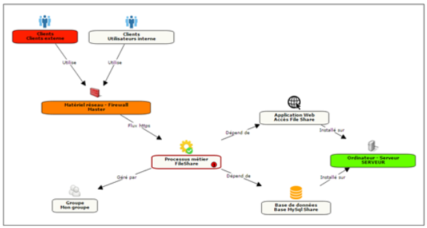

# Plugin CMDB for ITSM-NG

## Purpose
The Configuration Management DataBase (abbreviated CMDB), or configuration management database, is a database unifying the components of a computer system. It makes it possible to understand the organization between them and to modify their configuration.

## Installation

Installing this plugin is done following the standard process for itsm plugins, simply clone the git or download a release and place it within itsm's `plugins` folder.

Don't forget to set Apache rights, and enjoy !

## Features

* Add a Service object (for use with impact analysis)
* Add core objects not managed by impact analysis
* Add additional objects